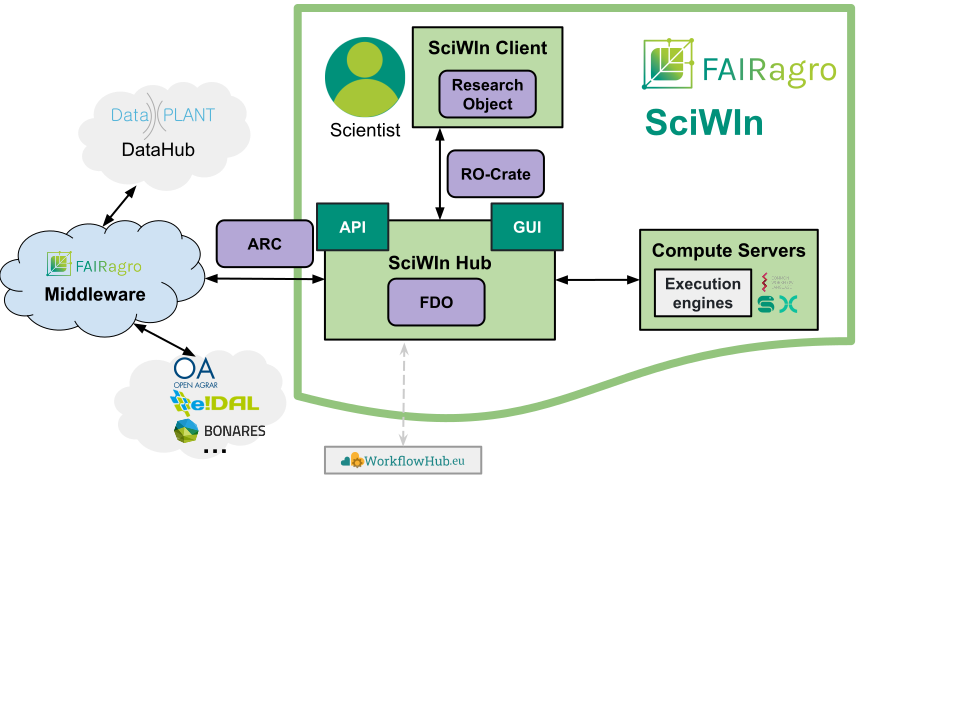
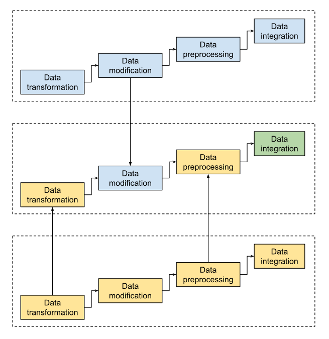
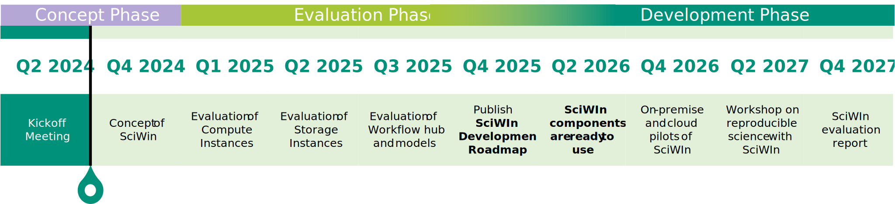

# SciWIn
## A Concept for a FAIR Scientific Workflow Infrastructure

- Antonia Leidel (Leibniz Institute of Plant Genetics and Crop Plant Research, IPK) 
- Dr. Jens Krumsieck (Thünen Institute)  
- Patrick König (Leibniz Institute of Plant Genetics and Crop Plant Research, IPK)  
- Dr. Harald von Waldow (Thünen Institute)  

on behalf of the FAIRagro consortium

## Abstract

FAIR[^1] research is becoming increasingly important, but developing and publishing FAIR workflows can be challenging. A Scientific Workflow Infrastructure (SciWIn) will facilitate collaboration and increase reusability by giving researchers access to workflows that can be combined and extended. SciWIn will also support scientists during development with versioning and help them to formally specify their workflows, making them executable on workflow engines. Detailed documentation will be provided through the use of FAIR Digital Objects (FDOs). 
 

## Concept

SciWIn will be able to integrate workflows and data from multiple repositories including a SciWIn Workflow Hub which will be developed in the process. Access of different research objects (RO) for workflow development will be handled by a central server. A stable workflow within a research object can be (semi-)automatically transformed into a formal workflow specification (e.g. CWL[^2]).
The SciWIn Workflow Engine will be able to execute such workflows. Stable Workflows are annotated with meta data and can be published to an appropriate repository that registers it with a PID[^3] (e.g. DOI[^4]).

## Reusable Data Handling
A multi-step workflow for data tranformation, modification, pre-processing and integration will be provided by the user. The research object keeps track of different versions and pushes its data to the central server. Versioning furthermore enables iterative development including bug fixes and other changes. The central server facilitates collaboration by providing access to organized reserach objects.

## Mix and Match

Users will be able to view multiple research objects, download parts of it (e.g. code, data, metadata, workflows, ...) and recombine those parts in new research objects. Derived parts link back to the original parts on the central server much like GitHub/GitLab forks. This provides an easy way to create new research objects by using already existing building blocks.

## Workflow execution and FAIR publication
Stable workflows can be (semi-) automatically transformed into a formal specification such as CWL. The Formal specification is compatible with workflow publishing platforms and execution engines like Nextflow or SnakeMake (vide infra). Stable workflows will be annotated with metadata and can be published in appropriate repositories using a PID system like DOI.

## Key benefits
SciWIn outputs reproducible research objects as FAIR DOs[^5]. By using already existing build blocks of existing workflows a lot of time can be saved, especially for common data integration and processing tasks. Furthermore collaboration between different research groups is possible which can lead to more productivity. Versioning of workflows and data provides reproducible research objects without the pitfall of breaking changes. Publication in appropriate repositories enables multiple benefits.

## Roadmap

## Workflow Engines
### SnakeMake
- Workflow management system with domain specific language (DSL) based on Python
- Transformation of input files in multiple steps via shell commands, Python code blocks, external scripts in Python, R or Julia or a Jupyter notebook

### Nextflow
- Workflow management system for scalable and portable workflows
- Independent execution of different processes written in scripting language (e.g. Bash, Python,...) on Linux platform 

[^1]: **F**indable **A**ccessible **I**nteroperable **R**eusable
[^2]: **C**ommon **W**orkflow **L**anguage
[^3]: **P**ersistant **ID**entifier
[^4]: **D**igital **O**bject **I**dentifier
[^5]: FAIR **D**igital **O**bject