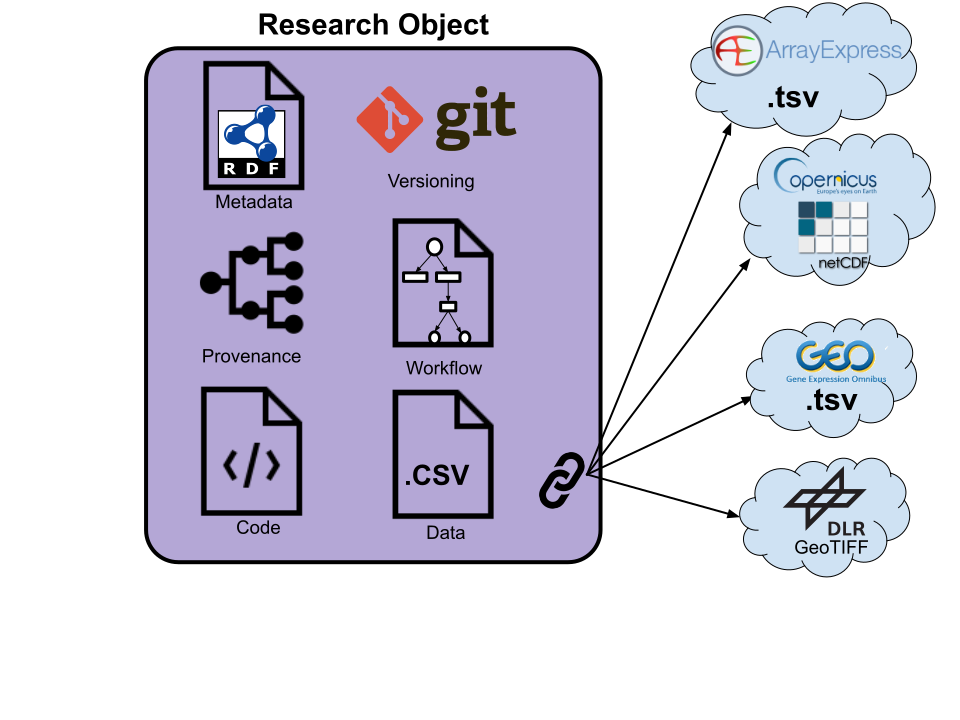

- **Antonia Leidel**1 
- **Dr. Jens Krumsieck**2  
- **Patrick König**1  
- **Dr. Harald von Waldow**2  
- **Florian Hoedt**2 

on behalf of the FAIRagro consortium

1 Leibniz Institute of Plant Genetics and Crop Plant Research, IPK - 
2 Thünen Institute

## Abstract

FAIR[^1] research is becoming increasingly important, but developing and publishing FAIR computational workflows can be challenging. A Scientific Workflow Infrastructure (SciWIn) will support scientists during data exploration and analysis with version control, the recording of workflows and provenance tracking. Specific tooling will help to formally specify annotated workflows, making them executable on different workflow engines. SciWIn will also facilitate collaboration and let researchers share, re-use, combine and extend workflows and associated data and code. The state-of-art annotation with metadata and encapsulation in FAIR Digital Objects (FDOs) will foster the FAIR publication of high-quality scientific work and help to further establish Open Science practices.
 
## Concept

As its name implies the **execution of computational workflows** will be a key part of SciWIn. Scientists will be able to communicate with the central **SciWIn Hub** component via a graphical user interface (GUI). Workflows contained in research objects (RO) following a formal workflow specification (e.g. CWL[^2]) can be uploaded to SciWIn Hub packed as RO-Crates. Once objects are handled by SciWIn Hub they are available as FAIR DOs[^5] with a PID[^3] (e.g. DOI[^4]). Workflows will be executed by the **SciWIn Compute Servers**, results including **full provenance information** are passed back to SciWIn Hub which informs the Scientist. SciWIn Hub will also communicate with the FAIRagro Middleware (Measure 4.2)[^6] which handles bidirectional communication with various repositories.

## Re-usable data handling
A multi-step workflow for data tranformation, modification, pre-processing and integration will be provided by the user. The research object keeps track of different versions and pushes its data to the central server. Versioning furthermore enables iterative development including bug fixes and other changes. The central server facilitates collaboration by providing access to organized reserach objects.

## Data Integration
Users will be able to view multiple research objects, download parts of it (e.g. code, data, metadata, workflows, ...) and recombine those parts in new research objects. Derived parts link back to the original parts on the central server much like GitHub/GitLab forks. This provides an easy way to create new research objects by using already existing building blocks.

## Workflow execution and FAIR publication
Stable workflows can be (semi-) automatically transformed into a formal specification such as CWL. The Formal specification is compatible with workflow publishing platforms and execution engines like Nextflow or SnakeMake (vide infra). Stable workflows will be annotated with metadata and can be published in appropriate repositories using a PID system like DOI or ARK0.

## Key benefits
SciWIn outputs reproducible research objects as FAIR DOs. By using already existing build blocks of existing workflows a lot of time can be saved, especially for common data integration and processing tasks. Furthermore collaboration between different research groups is possible which can lead to more productivity. Versioning of workflows and data provides reproducible research objects without the pitfall of breaking changes. Publication in appropriate repositories enables multiple benefits.

## Roadmap

***

[^1]: **F**indable **A**ccessible **I**nteroperable **R**eusable
[^2]: **C**ommon **W**orkflow **L**anguage
[^3]: **P**ersistant **ID**entifier
[^4]: **D**igital **O**bject **I**dentifier
[^5]: FAIR **D**igital **O**bject
[^6]: Information about Measure 4.2 can be found in the [FAIRagro Proposal](https://doi.org/10.5281/zenodo.8366884)