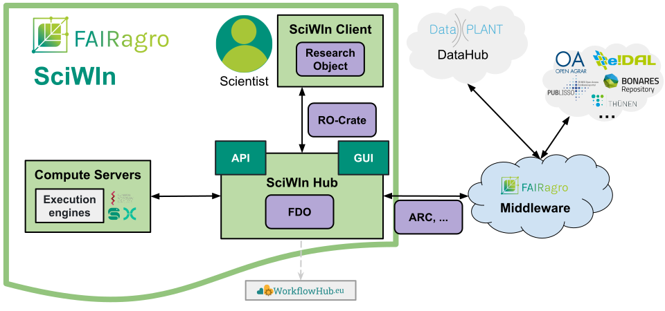
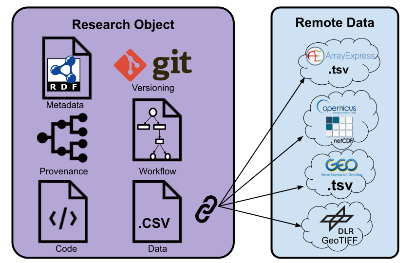

- **Antonia Leidel**1 
- **Dr. Jens Krumsieck**2  
- **Patrick König**1  
- **Dr. Harald von Waldow**2  
- **Florian Hoedt**2 

on behalf of the FAIRagro consortium

1 Leibniz Institute of Plant Genetics and Crop Plant Research, IPK - 
2 Thünen Institute

## Abstract

FAIR[^1] research is becoming increasingly important, but developing and publishing FAIR computational workflows can be challenging. A Scientific Workflow Infrastructure (SciWIn) will support scientists during data exploration and analysis with version control, the recording of workflows and provenance tracking. Specific tooling will help to formally specify annotated workflows, making them executable on different workflow engines. SciWIn will also facilitate collaboration and let researchers share, re-use, combine and extend workflows and associated data and code. The state-of-art annotation with metadata and encapsulation in FAIR Digital Objects (FDOs) will foster the FAIR publication of high-quality scientific work and help to further establish Open Science practices.
 
## Concept

As its name implies the **execution of computational workflows** will be a key part of SciWIn. Scientists will be able to communicate with the central **SciWIn Hub** component via a graphical user interface (GUI). Workflows contained in research objects (RO) following a formal workflow specification (e.g. CWL[^2]) can be uploaded to SciWIn Hub packed as RO-Crates. Once objects are handled by SciWIn Hub they are available as FAIR DOs[^5] with a PID[^3] (e.g. DOI[^4]). Workflows will be executed by the **SciWIn Compute Servers**, results including **full provenance information** are passed back to SciWIn Hub which informs the Scientist. SciWIn Hub will also communicate with the FAIRagro Middleware (Measure 4.2)[^6] which handles bidirectional communication with various repositories.

## Re-usable data handling
- The user records ad-hoc workflow for data pre-processing, transformation, analysis, … 
- Iterative & collaborative workflow development including version control of data and code
- Creation of shareable research objects with provenance information & metadata
- SciWIn Hub facilitates collaboration by providing shared access to research objects

## Integration & exploration
- Explore research objects (RO) on SciWIn Hub
- Download parts (code, data, metadata)
- Recombine artifacts in new research objects
- Upload to SciWIn Hub to integrate into RO collection

## Workflow execution and FAIR publication
- Workflows can be (semi-) automatically transformed into a formal specification 
- Compatible with workflow publishing platforms and execution engines 
- Stable workflow is annotated with metadata (linked data, schema.org) to make it findable
- Publication of the FAIR DO in an appropriate repository brokered by FAIRagro Middleware
- Repository registers research object in a PID system (DOI, ARK)

## Roadmap

***

[^1]: **F**indable **A**ccessible **I**nteroperable **R**eusable
[^2]: **C**ommon **W**orkflow **L**anguage
[^3]: **P**ersistant **ID**entifier
[^4]: **D**igital **O**bject **I**dentifier
[^5]: FAIR **D**igital **O**bject
[^6]: Information about Measure 4.2 can be found in the [FAIRagro Proposal](https://doi.org/10.5281/zenodo.8366884)